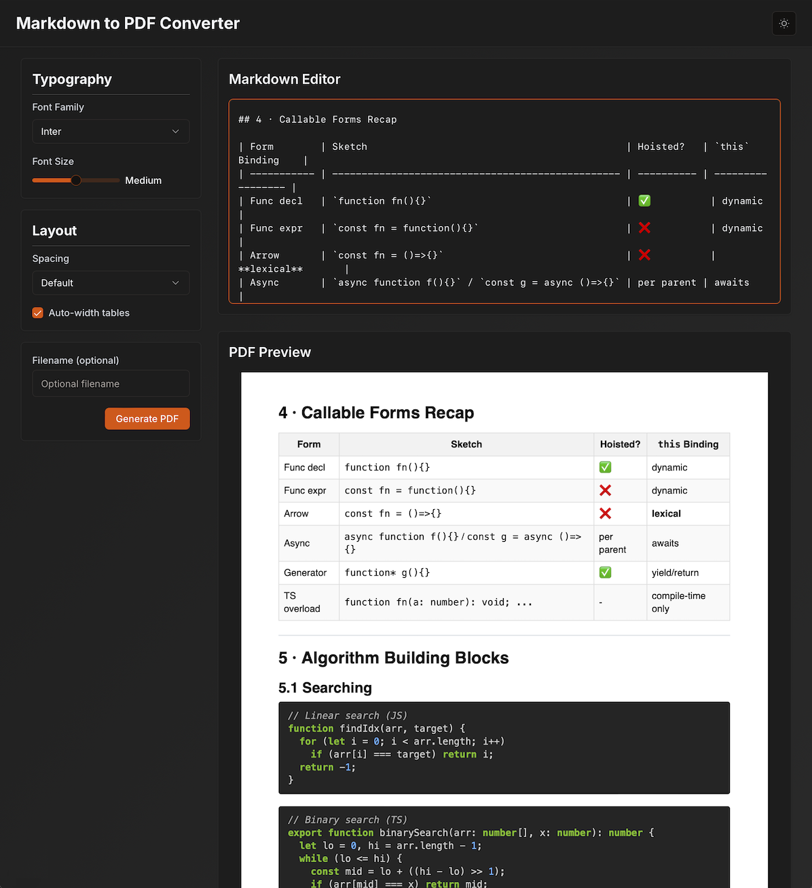

## [Projects]()

### Markdown to PDF Converter for ChatGPT

- A full-stack web application that converts ChatGPT markdown to beautifully styled PDFs with customizable typography layout options, and code syntax highlighting.
- Python, TypesScript, Next.js, React, Node.js, HTML, CSS

---

### VirtueRed Red Teaming Application

- LLM Red Teaming application rebuild in Next.js
- Next.js, React, TypesScript, Node.js, HTML, CSS

---

### [SearchThatSong.com](https://searchthatsong.com)

- AI-driven music discovery application
- Python, Javascript, React, Node.js, HTML, CSS

---

### [SmallBusinessChatbot.com](https://SmallBusinessChatbot.com)

- AI-driven customer support chatbot
- Python, Javascript, React, Node.js, HTML, CSS

---

### Apple iCloud Webmail

- Apple iCloud Webmail Application
- Javascript, SproutCore, Ruby, Node.js, HTML, CSS

---

### iCloud Mail Drop

- Mail Drop feature for sending large attachments via iCloud Mail
- Javascript, SproutCore, HTML, CSS

---

### MobileMe/ iCloud AddressBook

- AddressBook feature for use across MobileMe and iCloud Web Applications
- Javascript, SproutCore, HTML, CSS

---

### Apple MobileMe Webmail

- Apple MobileMe Webmail Application
- Javascript, SproutCore, Ruby, HTML, CSS

---

### Apple Jobs

- Apple Jobs Website
- Javascript, PHP, HTML, CSS

---

Check out my [GitHub repositories](https://github.com/astral-matrix) for additional projects and code samples.

_© 2025 Andrew Johnson._
