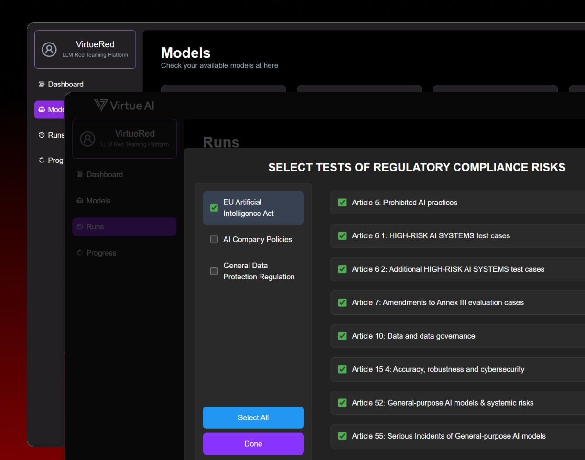
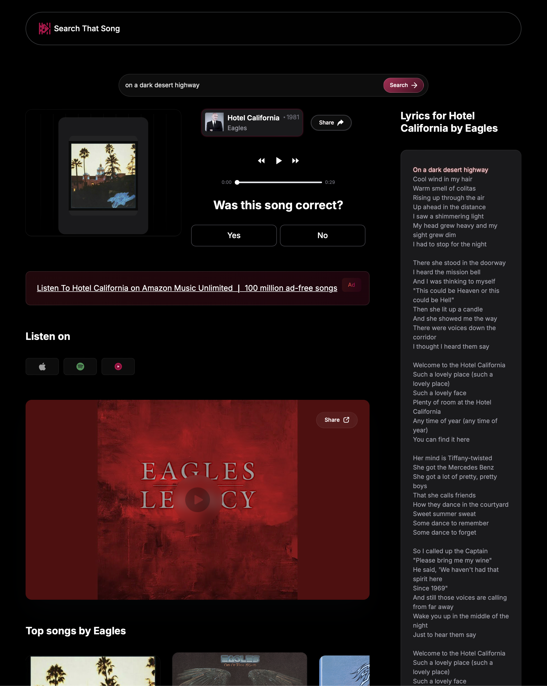
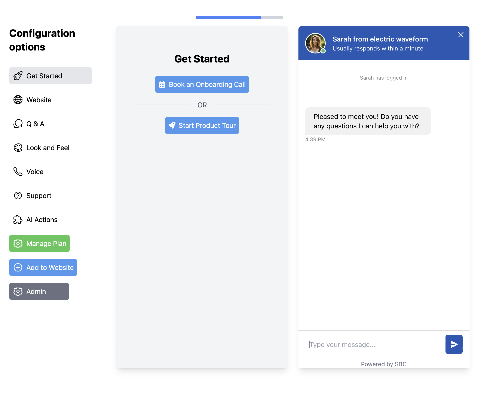
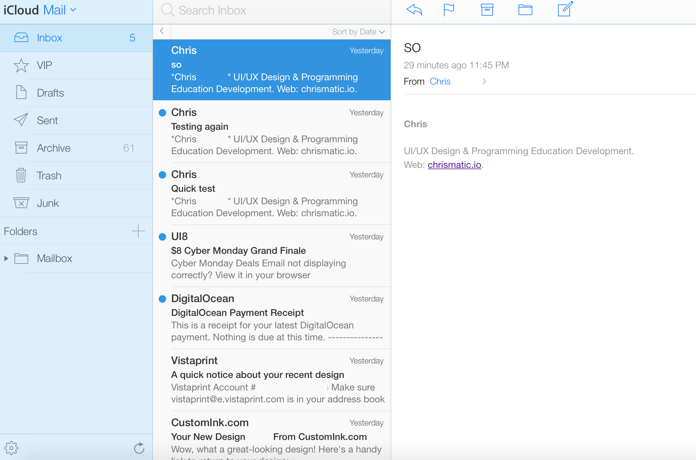
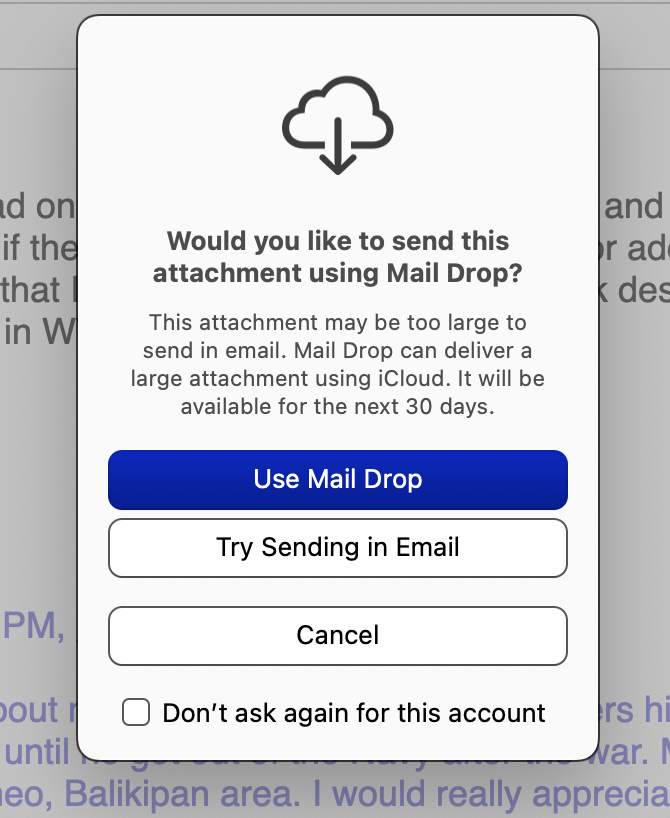
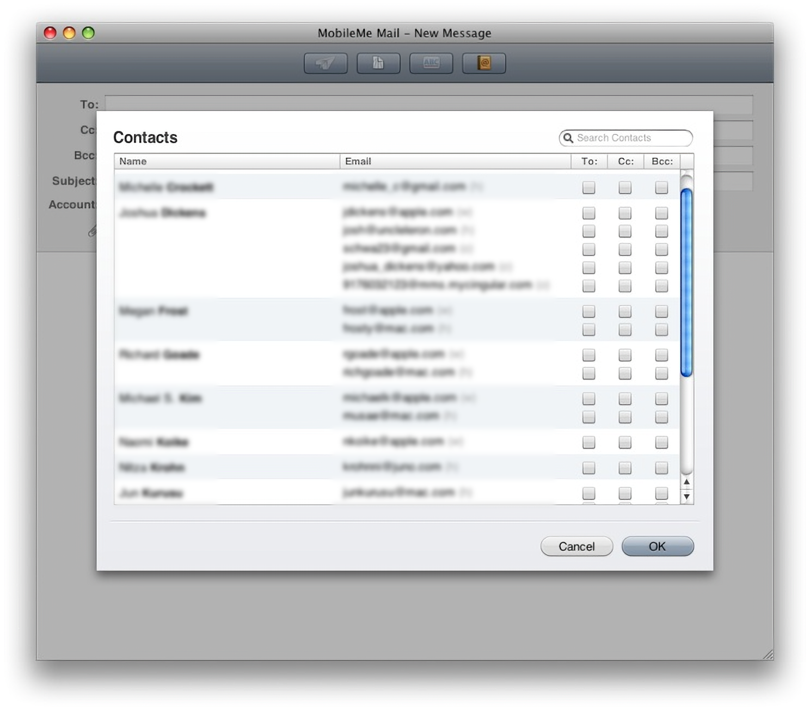
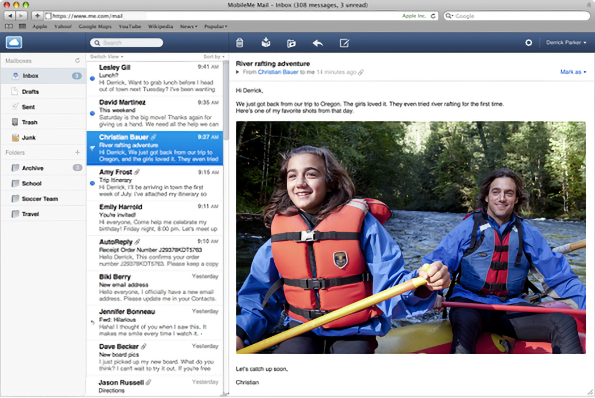
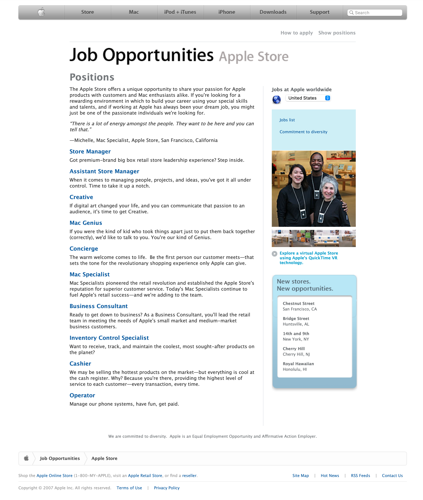
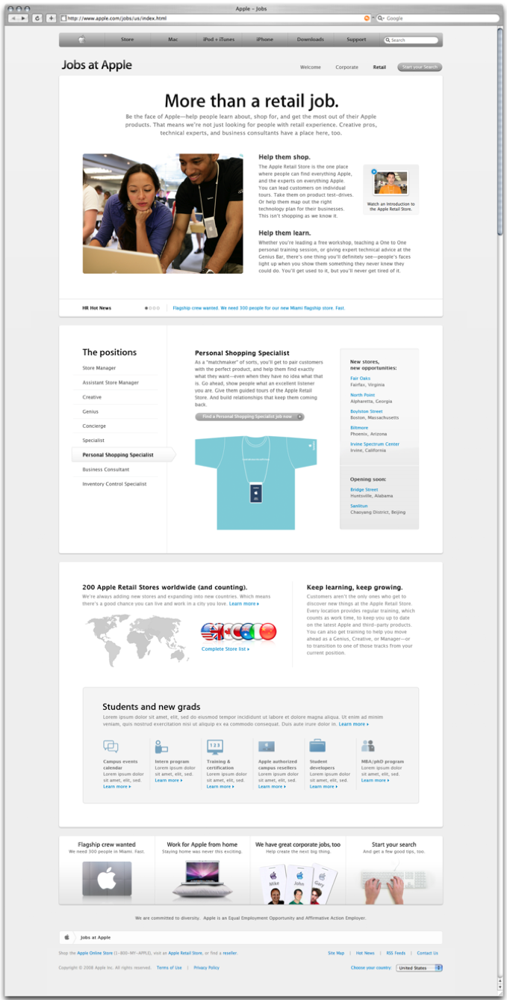

### VirtueRed Red Teaming Application 2025

- LLM Red Teaming application rebuild in Next.js
- Next.js, React, TypesScript, Node.js, HTML, CSS

---

### [SearchThatSong.com](https://searchthatsong.com) 2004

- AI-driven music discovery application
- Python, Javascript, React, Node.js, HTML, CSS

---

### [SmallBusinessChatbot.com](https://SmallBusinessChatbot.com) 2004

- AI-driven customer support chatbot
- Python, Javascript, React, Node.js, HTML, CSS

---

### Apple iCloud Webmail 2011-2018

- Apple iCloud Webmail Application
- Javascript, SproutCore, Ruby, Node.js, HTML, CSS

---

### iCloud Mail Drop 2014

- Mail Drop feature for sending large attachments via iCloud Mail
- Javascript, SproutCore, HTML, CSS

---

### MobileMe/ iCloud AddressBook 2010-2014

- AddressBook feature for use across MobileMe and iCloud Web Applications
- Javascript, SproutCore, HTML, CSS

---

### Apple MobileMe Webmail 2009-2011

- Apple MobileMe Webmail Application
- Javascript, SproutCore, Ruby, HTML, CSS

---

### Apple Jobs 2006-2009

- Apple Jobs Website
- Javascript, PHP, HTML, CSS

---

Check out my [GitHub repositories](https://github.com/astral-matrix) for additional projects and code samples.

_© 2025 Andrew Johnson._
