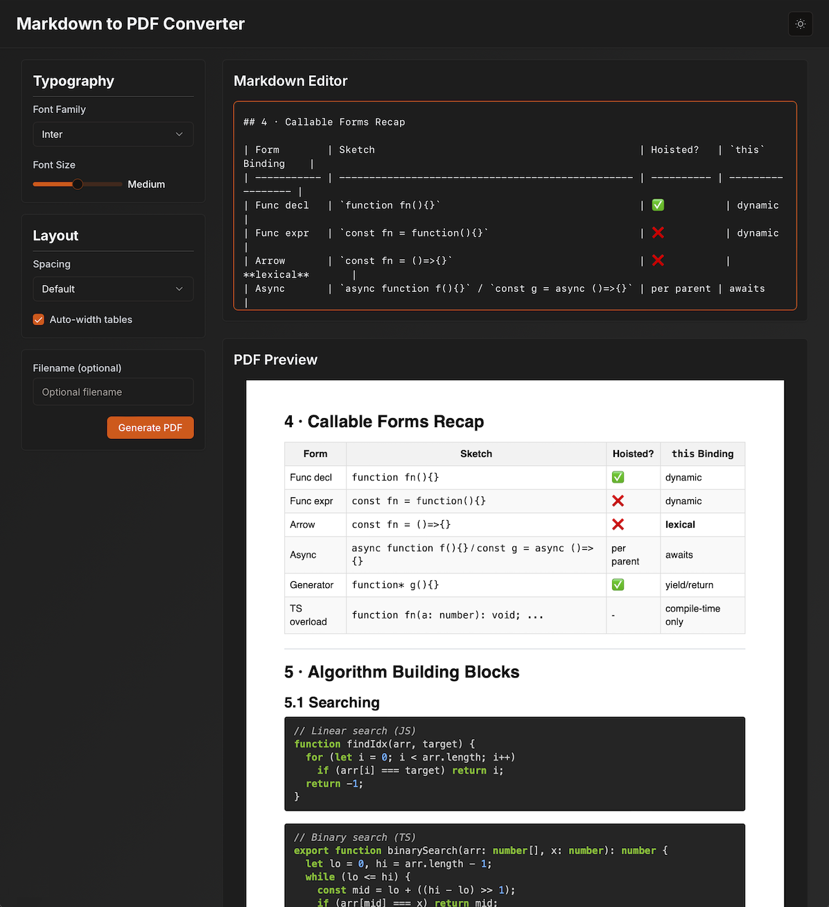
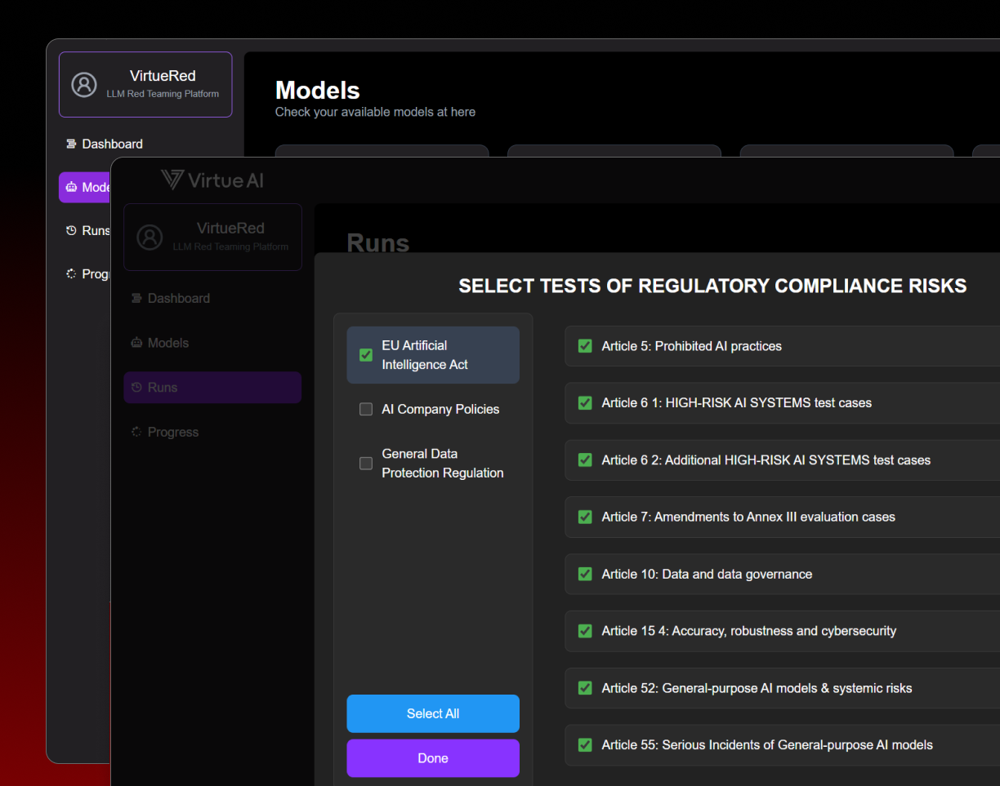
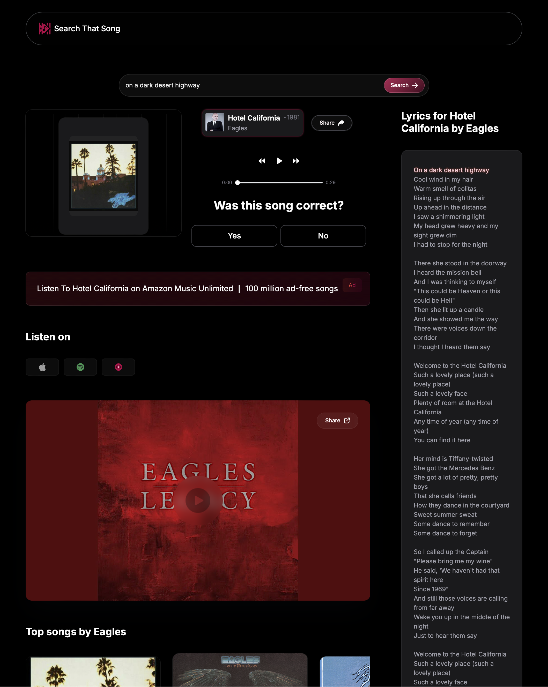
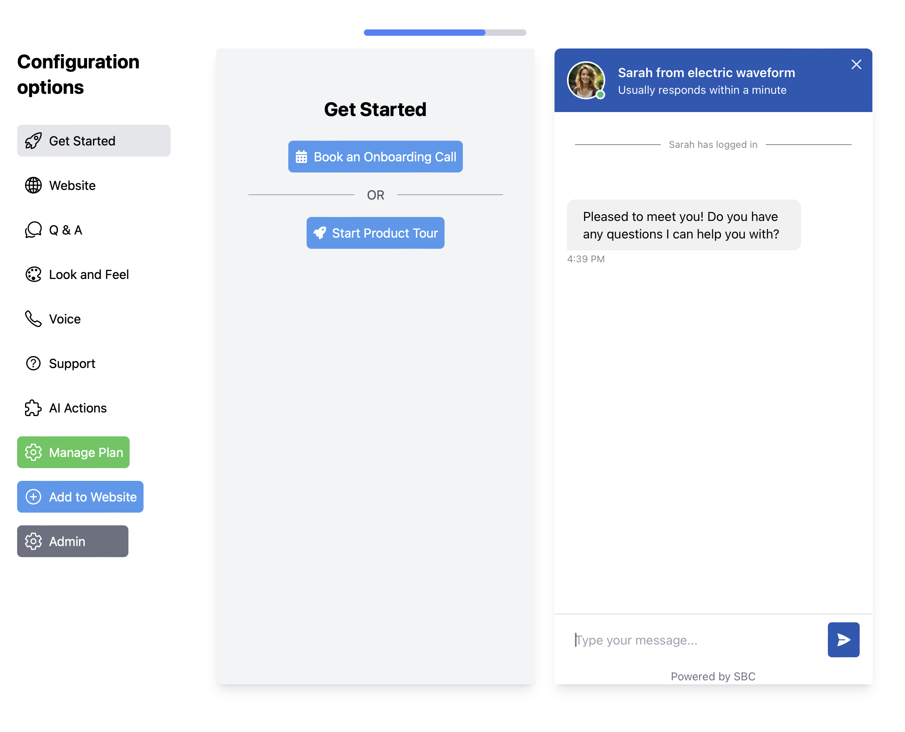
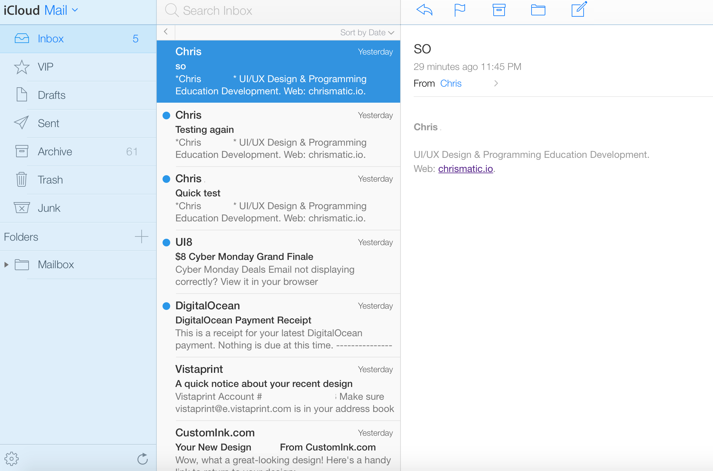
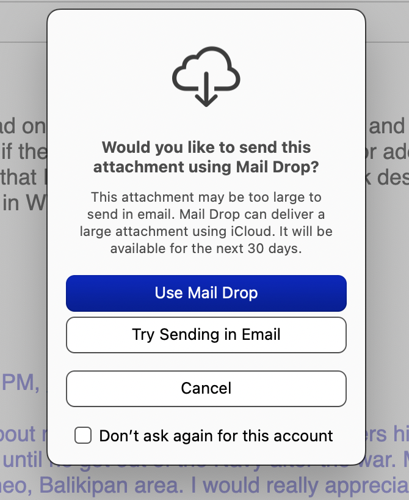
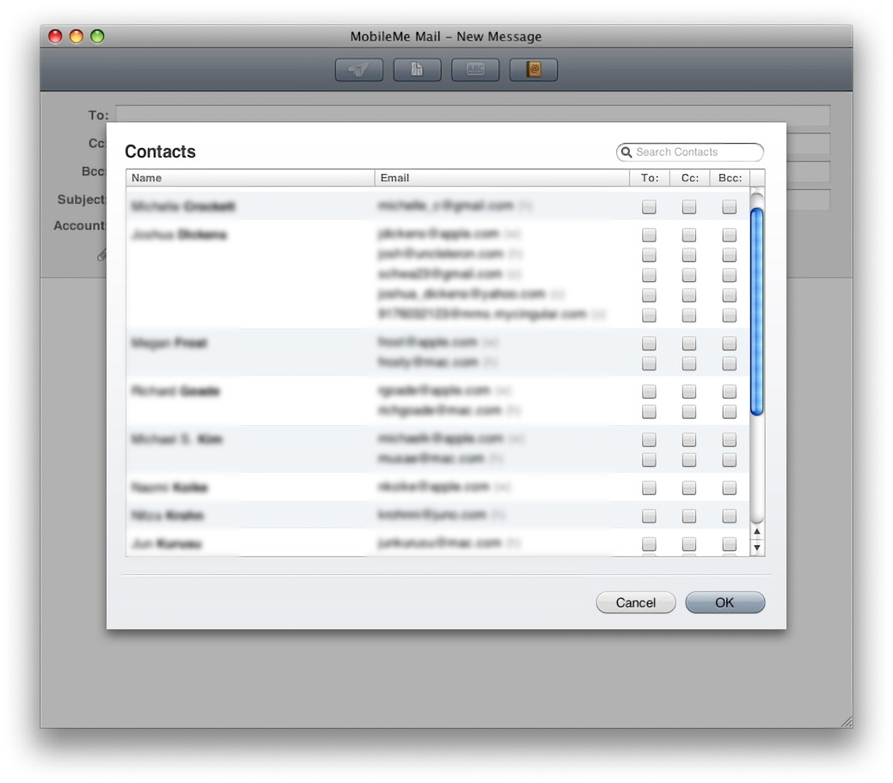
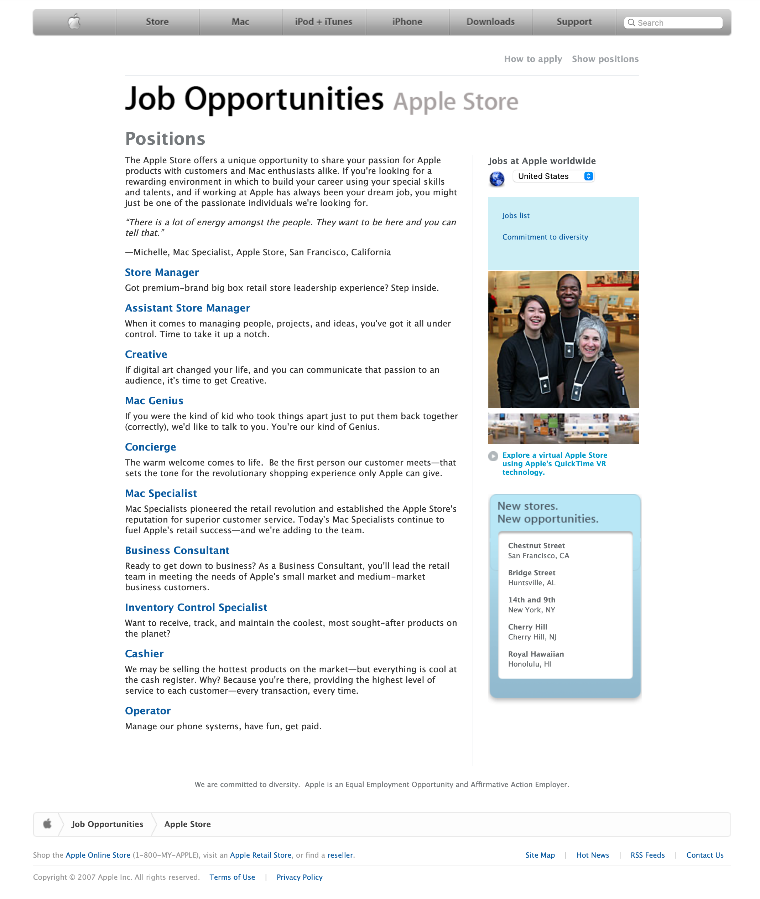

## [Projects]()

### Markdown to PDF Converter for ChatGPT

- A full-stack web application that converts ChatGPT markdown to beautifully styled PDFs with customizable typography layout options, and code syntax highlighting.
- Python, TypesScript, Next.js, React, Node.js, HTML, CSS



---

### VirtueRed Red Teaming Application

- LLM Red Teaming application rebuild in Next.js
- Next.js, React, TypesScript, Node.js, HTML, CSS



---

### [SearchThatSong.com](https://searchthatsong.com)

- AI-driven music discovery application
- Python, Javascript, React, Node.js, HTML, CSS



---

### [SmallBusinessChatbot.com](https://SmallBusinessChatbot.com)

- AI-driven customer support chatbot
- Python, Javascript, React, Node.js, HTML, CSS



---

### Apple iCloud Webmail

- Apple iCloud Webmail Application
- Javascript, SproutCore, Ruby, Node.js, HTML, CSS



---

### iCloud Mail Drop

- Mail Drop feature for sending large attachments via iCloud Mail
- Javascript, SproutCore, HTML, CSS



---

### MobileMe/ iCloud AddressBook

- AddressBook feature for use across MobileMe and iCloud Web Applications
- Javascript, SproutCore, HTML, CSS



---

### Apple MobileMe Webmail

- Apple MobileMe Webmail Application
- Javascript, SproutCore, Ruby, HTML, CSS


---

### Apple Jobs

- Apple Jobs Website
- Javascript, PHP, HTML, CSS




---

## Local Preview Server

### Jekyll/Bundler commands:

```
# install dependencies
# reads Gemfile and installs all required gems
bundle install

# updates all gems to their latest versions (within Gemfile constraints)
bundle update

# start local server
# builds and serves the site at http://localhost:4000 with live reload
bundle exec jekyll serve

# build site only (no server):
# generates the static site into the _site directory
```

Useful flags for serve:

```
--livereload  # Auto-refresh browser on changes
--drafts  # Include draft posts
--port 5000 # Use a different port
--host 0.0.0.0 # Make accessible on your network
```

Check out my [GitHub repositories](https://github.com/astral-matrix) for additional projects and code samples.

_© 2025 Andrew Johnson._
